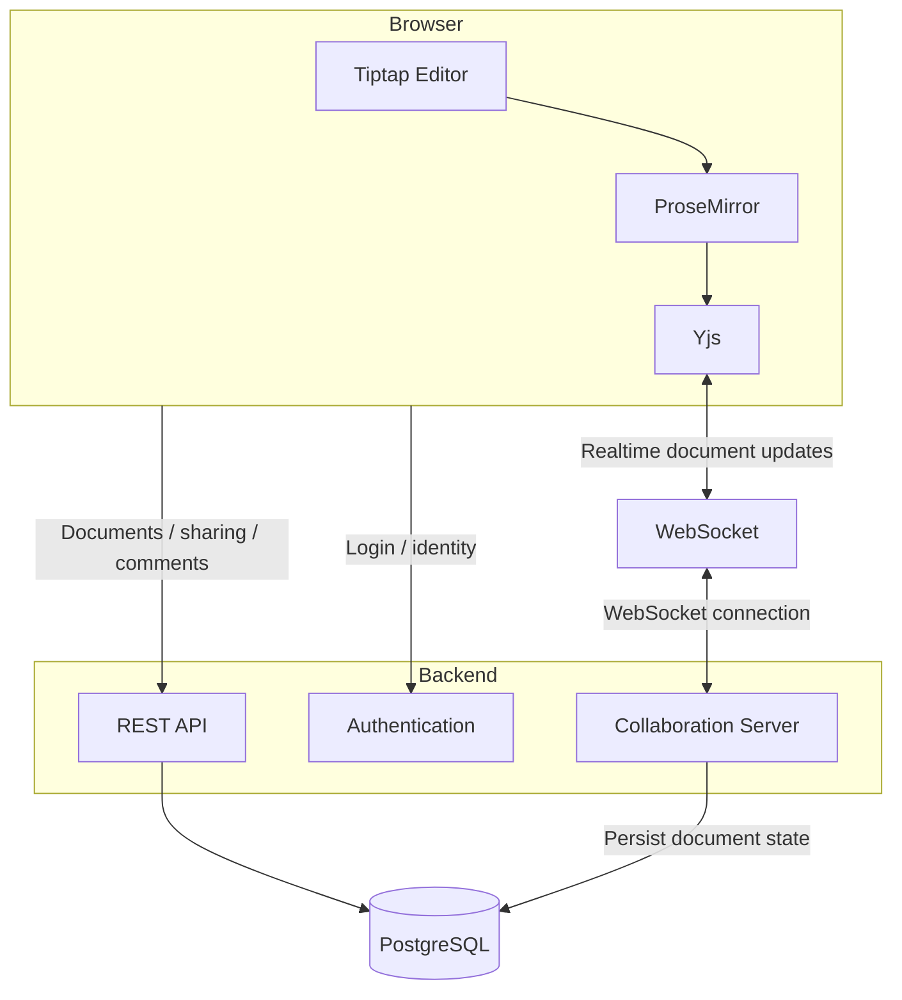

<!-- BEGIN:nextjs-agent-rules -->

# This is NOT the Next.js you know

This version has breaking changes — APIs, conventions, and file structure may all differ from your training data. Read the relevant guide in `node_modules/next/dist/docs/` (resolved from this file's directory; in monorepos the `next` package may not be visible from the repo root) before writing any code. Heed deprecation notices.

This block is written and re-added by `next dev` — verify at `node_modules/next/dist/server/lib/generate-agent-files.js`. Removing it from a diff only re-creates the uncommitted change; committing it with your work keeps the tree clean.

<!-- END:nextjs-agent-rules -->

# Collaborative Document Editor

## 1. Project Goal

Build a web-based collaborative document editor inspired by Google Docs.

The application should allow multiple users to:

* Create and edit text documents.
* Edit the same document simultaneously.
* See changes from other users in real time.
* Maintain a consistent document state across clients.
* Authenticate users.
* Share documents with other users.
* Persist documents and related metadata.

This is **not intended to reproduce Google Docs' internal protocol**. Use standard libraries and protocols while implementing the same fundamental collaborative-editing behavior.

## 2. Core Architecture



## 3. Technology Stack

### Frontend

* **Next.js** — web application framework.
* **React** — UI layer.
* **Tiptap** — rich-text editor framework.
* **ProseMirror** — underlying document model and editing engine.
* **Yjs** — CRDT-based collaborative document state.

### Realtime Communication

* **WebSocket** — persistent bidirectional communication between browser and collaboration server.

### Backend

* **Node.js** — backend runtime.
* REST API for non-realtime application operations.
* WebSocket server for realtime collaboration.

### Database

* **PostgreSQL** — persistent storage.

### Authentication

* **Auth.js** — authentication and session management.


# 4. Component Responsibilities

## 4.1 Next.js

Responsible for:

* Application routing.
* Rendering the frontend.
* API routes/server-side functionality where appropriate.
* Serving document pages.
* Authentication integration.

Example routes:

```text
/login
/documents
/document/[id]
```

## 4.2 React

Responsible for the application UI.

Examples:

* Document list.
* Toolbar.
* Editor container.
* User information.
* Sharing dialog.
* Comments UI.
* Document settings.

React should not implement the document model or CRDT itself.

## 4.3 Tiptap

Tiptap is the primary editor interface.

It should handle:

* Text editing.
* Bold/italic/underline.
* Headings.
* Paragraphs.
* Lists.
* Links.
* Selection.
* Keyboard shortcuts.
* Editor commands.

Tiptap is built on top of ProseMirror.

Conceptually:

```text
React
  ↓
Tiptap
  ↓
ProseMirror
```

## 4.4 ProseMirror

ProseMirror provides the underlying document model and editing engine.

It is responsible for:

* Document structure.
* Nodes.
* Marks.
* Positions.
* Selections.
* Transactions.
* Transformations.

A document should be represented structurally rather than simply as one large string.

Conceptually:

```text
Document
├── Paragraph
│   └── "Hello world"
│
├── Heading
│   └── "My Project"
│
└── Paragraph
    └── "Some text..."
```

When a user edits the document, ProseMirror produces transactions describing the changes.

Example:

```text
insert "hello" at position 10
```

These changes can then be synchronized through Yjs.


# 5. Yjs

Yjs is the collaboration layer.

It provides a CRDT-based shared document state.

The purpose is to allow multiple independent clients to edit the same document concurrently while eventually converging on the same state.

Conceptually:

```text
        Shared Document
              │
       ┌──────┴──────┐
       │             │
    Client A       Client B
       │             │
     Yjs A          Yjs B
       │             │
       └──────┬──────┘
              │
       Synchronization
```

Yjs should handle:

* Concurrent edits.
* Merging changes.
* Synchronization state.
* Offline/local changes.
* Conflict resolution.
* Shared document state.

Do not implement a custom CRDT unless there is a specific reason to do so.

# 6. WebSocket

WebSocket provides the realtime communication channel.

The connection should remain open while a user is editing a document.

Conceptually:

```text
Client A
    │
    │ WebSocket
    ▼
Collaboration Server
    ▲
    │ WebSocket
    │
Client B
```

When Client A makes a Yjs update:

```text
Client A
   ↓
Yjs
   ↓
WebSocket
   ↓
Collaboration Server
   ↓
WebSocket
   ↓
Client B
   ↓
Yjs
```

The other client then updates its local document.

WebSocket is the **transport**.

Yjs is responsible for the **shared state and conflict resolution**.

# 7. Collaboration Server

The collaboration server is responsible for managing realtime connections.

Responsibilities:

* Accept WebSocket connections.
* Authenticate WebSocket connections.
* Associate connections with documents.
* Receive Yjs updates.
* Broadcast updates to other connected clients.
* Manage active document sessions.
* Handle connection/disconnection events.
* Persist collaborative document state when appropriate.

Conceptually:

```text
Document 123
│
├── User A WebSocket
├── User B WebSocket
└── User C WebSocket
```

If User A makes a change:

```text
User A
  ↓
Collaboration Server
  ├──→ User B
  └──→ User C
```

The collaboration server should not implement CRDT conflict resolution itself if Yjs is being used for that purpose.

# 8. REST API

REST API should handle non-realtime application operations.

Examples:

```text
POST   /api/documents
GET    /api/documents
GET    /api/documents/:id
PATCH  /api/documents/:id
DELETE /api/documents/:id
```

Potential responsibilities:

* Create documents.
* Rename documents.
* Retrieve document metadata.
* List user's documents.
* Delete documents.
* Manage sharing.
* Manage permissions.
* Manage comments.
* Retrieve version/history metadata.

Realtime document edits should go through WebSocket/Yjs rather than normal REST requests.

# 9. Authentication

Authentication answers:

> Who is this user?

Use Auth.js for:

* Login.
* Sessions.
* User identity.
* Authentication state.

Authorization should determine what a user is allowed to do.

Example:

```text
Document 123

Alice → owner
Bob   → editor
John  → viewer
```

Authentication:

```text
Who is Bob?
```

Authorization:

```text
Can Bob edit Document 123?
```

These are separate concerns.

# 10. PostgreSQL

PostgreSQL is the persistent database.

Store application data such as:

```text
users
documents
document_members
```

Example conceptual schema:

```text
users
----------------
id
name
email
created_at

documents
----------------
id
title
owner_id
created_at
updated_at

document_members
----------------
document_id
user_id
role
```

The database should store persistent application state.

Do not use PostgreSQL as the realtime transport.

# 11. Data Flow

## Opening a document

```text
User
 ↓
Next.js
 ↓
Authentication
 ↓
REST API
 ↓
PostgreSQL
 ↓
Document metadata
 ↓
Editor loads
 ↓
Yjs initializes
 ↓
WebSocket connection
 ↓
Collaboration Server
```

## User types text

Suppose User A types:

```text
hello
```

The conceptual flow is:

```text
Keyboard input
      ↓
Tiptap
      ↓
ProseMirror
      ↓
ProseMirror transaction
      ↓
Yjs
      ↓
WebSocket
      ↓
Collaboration Server
      ↓
Other connected clients
      ↓
Other clients' Yjs
      ↓
ProseMirror
      ↓
Tiptap
      ↓
Other users see the change
```

# 12. Concurrent Editing

This is the most important technical feature.

Suppose the initial document is:

```text
Hello world
```

Two users edit simultaneously.

User A:

```text
Hello beautiful world
```

User B:

```text
Hello world!
```

The system must merge the independent changes correctly.

Yjs/CRDT handles this synchronization.

The goal is that all clients eventually converge to the same document state.

```text
Client A ──┐
           │
           ├── CRDT synchronization ──→ same final state
           │
Client B ──┘
```

# 13. Presence

Presence is separate from persistent document content.

Examples:

```text
Alice is currently editing.
Bob's cursor is at position 42.
Charlie selected some text.
```

Conceptually:

```text
Persistent document
└── "Hello world"

Realtime presence
├── Alice → cursor 10
├── Bob → cursor 25
└── Charlie → selection 5-12
```

Presence should not modify the actual document text.

# 14. Important Architectural Distinction

The project has two major communication paths.

### Realtime path

Used for collaborative editing:

```text
Tiptap
  ↓
ProseMirror
  ↓
Yjs
  ↓
WebSocket
  ↓
Collaboration Server
  ↓
Other Clients
```

### Application/API path

Used for normal application operations:

```text
Browser
  ↓
REST API
  ↓
PostgreSQL
```

Examples:

```text
Create document
Rename document
Share document
Change permissions
Get document list
Manage comments
```