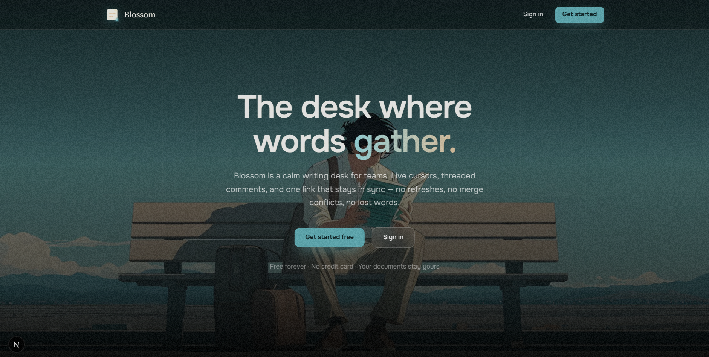
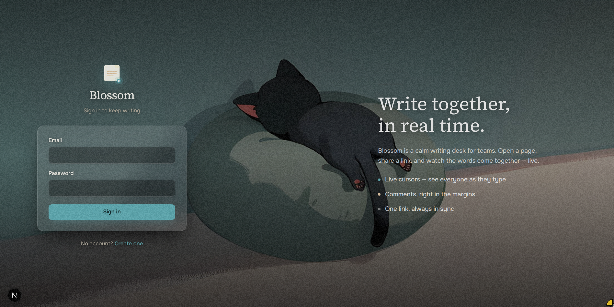

# Blossom

A collaborative document editor inspired by Google Docs — write together, in real time.

Multiple users can create documents, edit them simultaneously with live cursors and carets, leave comments, and share documents with editors or viewers. All clients converge on the same state through CRDT-based synchronization, so there are no merge conflicts and no refreshes.

## Screenshots

### Home



### Log in



## Tech Stack

| Layer | Technology |
| --- | --- |
| Frontend | Next.js 16, React 19, TypeScript, Tailwind CSS v4 |
| Editor | Tiptap v3 on ProseMirror |
| Collaboration | Yjs (CRDT), y-websocket, y-protocols |
| Realtime transport | WebSocket (custom collaboration server) |
| Backend | Next.js API routes, Auth.js v5 (credentials + JWT) |
| Database | PostgreSQL (hosted on Supabase) via Prisma 7 (driver adapters) |

## Architecture

```
Browser
├── Tiptap editor ── ProseMirror ── Yjs
│                                     │
│            WebSocket (Yjs updates)  │
│                                     ▼
│                            Collaboration Server
│                         (rooms, roles, persistence)
│                                     │
│                                     ▼
│                               Supabase PostgreSQL
│                ┌───────────┬───────────────┬──────────────┐
│                │ documents │ yjs_updates   │ yjs_snapshots│
│                │ members   │ shares        │ comments     │
│                └───────────┴───────────────┴──────────────┘
│
├── REST API (documents, sharing, share links, comments, auth)
```

Two communication paths:

- **Realtime path** — keystrokes flow Tiptap → ProseMirror → Yjs → WebSocket → collaboration server → other connected clients. Yjs handles concurrent edits, conflict resolution and convergence.
- **Application path** — REST API calls for non-realtime operations (create/rename/delete documents, share, share links, comments, auth).

## Getting Started

### Prerequisites

- Node.js 20+
- A Supabase project with its Postgres database enabled (free tier is fine)

### 1. Install dependencies

```bash
npm install
```

### 2. Configure environment

```bash
cp .env.example .env
```

Then fill in the values (get the pooler connection string from Supabase → Database → Connection settings):

```bash
# Use the pooler host aws-0-<region>.pooler.supabase.com
# Port 5432 = session pooler (used by the app and for migrations)
# Port 6543 = transaction pooler (alternative for runtime)
DATABASE_URL="postgresql://postgres.<project-ref>:<password>@aws-0-ap-southeast-1.pooler.supabase.com:5432/postgres"
AUTH_SECRET="openssl rand -base64 32"
AUTH_URL="http://localhost:3000"
NEXT_PUBLIC_WS_URL="ws://localhost:1234"
COLLAB_PORT=1234
```

URL-encode special characters in the password (e.g. `@` → `%40`).

### 3. Set up the database

```bash
npm run db:generate
DATABASE_URL="<your-session-pooler-url>:5432/postgres" npx prisma migrate deploy
```

`prisma migrate dev` does not work through the pooler (it needs a shadow database); use `migrate deploy` with the session pooler URL instead.

### 4. Start the collaboration server

```bash
npm run dev:collab
```

### 5. Start the app

```bash
npm run dev
```

Open [http://localhost:3000](http://localhost:3000). Create an account, create a document, and open the same document in a second browser/tab to see live collaboration.

## Scripts

| Script | Description |
| --- | --- |
| `npm run dev` | Start the Next.js dev server |
| `npm run dev:collab` | Start the WebSocket collaboration server (with watch) |
| `npm run build` | Production build |
| `npm run start` | Start the production server |
| `npm run lint` | Run ESLint |
| `npm run typecheck` | Run TypeScript type checking |
| `npm run db:generate` | Generate the Prisma client |
| `npm run db:migrate` | Apply migrations with `prisma migrate dev` (local Postgres only; use `migrate deploy` against Supabase) |
| `npm run db:studio` | Open Prisma Studio |

## Features

- **Real-time collaborative editing** — CRDT-based (Yjs); concurrent edits from multiple users merge and converge automatically
- **Live presence** — cursors, carets and selections of other collaborators, plus an online-users indicator
- **Rich text editor** — headings, bold/italic/underline/strikethrough, lists, quotes, code blocks, links, undo/redo
- **Comments** — side-panel notes with resolve/delete, tied to documents
- **Sharing & roles** — share by email with `EDITOR` or `VIEWER` access, or create a revocable share link (`/s/<id>`) that grants anyone with the link `VIEWER`/`EDITOR` access without an account match; only the owner can manage sharing or delete
- **Document management** — create, rename, delete, and browse documents with last-edited info; shared documents are visually flagged
- **Authentication** — Auth.js credentials provider with bcrypt-hashed passwords and JWT sessions

## Project Structure

```
app/
├── api/                  # REST API routes (auth, documents, sharing, share links, comments, collab token)
├── document/[id]/        # Editor page (editor, toolbar, comments panel, share dialog)
├── documents/            # Document list ("desk") page
├── s/[shareId]/          # Share-link redirect route
├── login/ signup/        # Auth pages
├── page.tsx              # Landing page
└── globals.css           # Theme (beach palette), paper page, editor typography
auth.ts                   # Auth.js configuration
server/collab-server.ts   # Standalone WebSocket collaboration server
lib/                      # Prisma client, permissions, WS token signing, user colors
prisma/schema.prisma      # Database schema
components/               # Brand logo, brand link
public/imgs/              # Background images
```

## Database Schema

- **users** — id, name, email, passwordHash, timestamps
- **documents** — id, title, ownerId, timestamps
- **document_members** — documentId, userId, role (`OWNER` / `EDITOR` / `VIEWER`)
- **document_shares** — id, documentId, role, createdAt (share links, no expiry)
- **yjs_updates** — id, documentId, seq (autoincrement), update (bytea), createdAt
- **yjs_snapshots** — documentId (unique), seq, snapshot (bytea), createdAt
- **comments** — id, documentId, authorId, text, resolved, timestamps

Document content is never stored as a whole. The collaboration server writes incremental Yjs binary updates (`yjs_updates`) and periodically stores a compacted snapshot (`yjs_snapshots`), after which older updates are pruned. Restoring a document = latest snapshot + all updates after it.

## How Realtime Editing Works

1. The editor page fetches a short-lived JWT (with the user's role) from `/api/collab/token` and connects a `WebsocketProvider` to the collaboration server.
2. Keystrokes produce ProseMirror transactions, which the Tiptap Collaboration extension applies to the shared `Y.Doc`.
3. Yjs encodes the changes and sends them over the WebSocket; the server broadcasts them to every other client in the document room.
4. Incoming updates are applied locally and rendered by Tiptap — other users see the change instantly, including remote carets.
5. The server buffers updates, merges them, and flushes them to `yjs_updates` every 2 s. Every 100 updates or 5 min of activity it takes a snapshot and compacts older updates.
6. Viewers (role from the token) can connect, sync, and see presence, but the server drops any document updates they submit.

## License

[MIT](LICENSE) — free to use, modify and distribute.